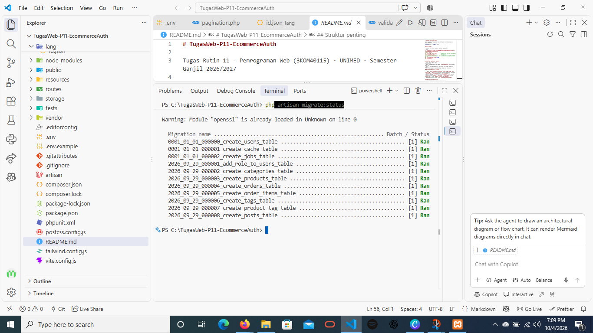
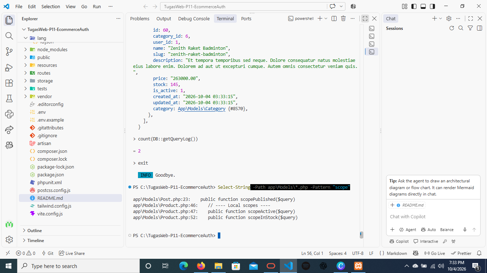
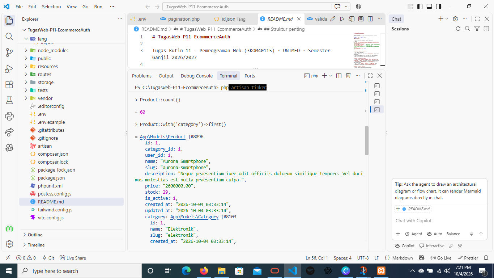
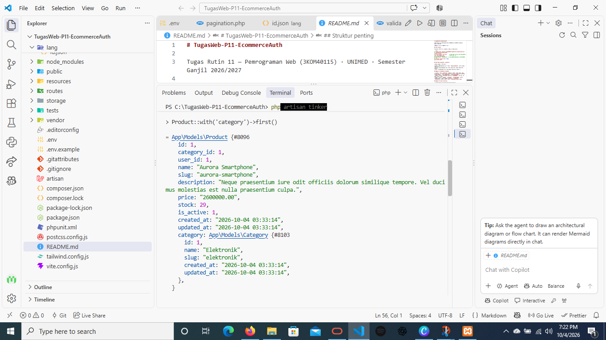
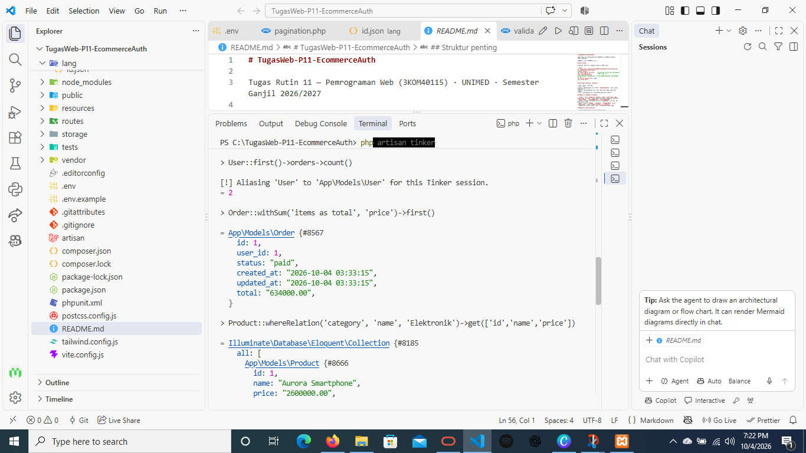
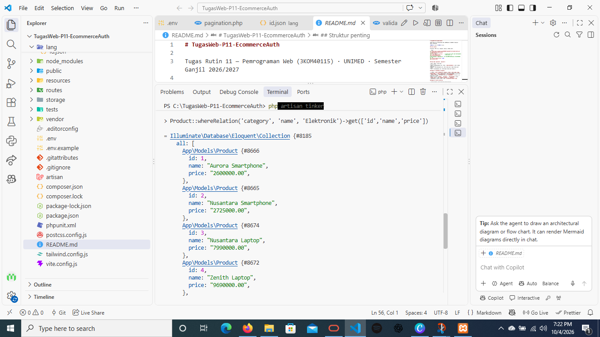
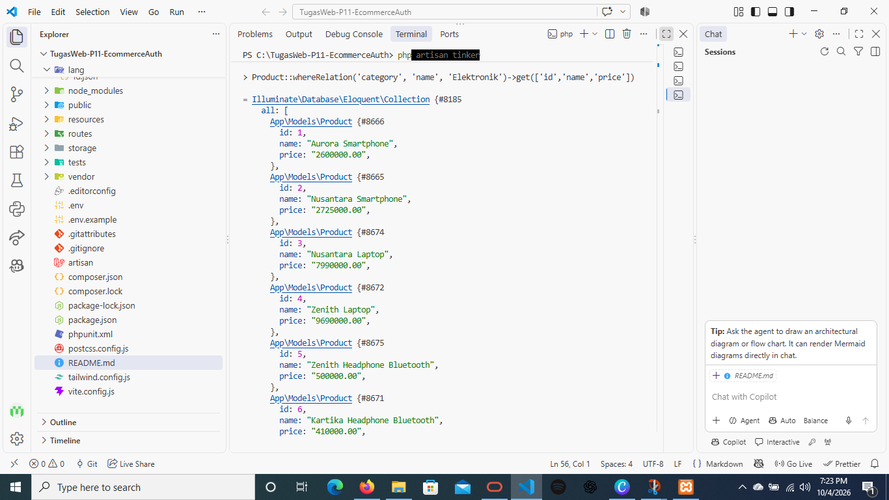
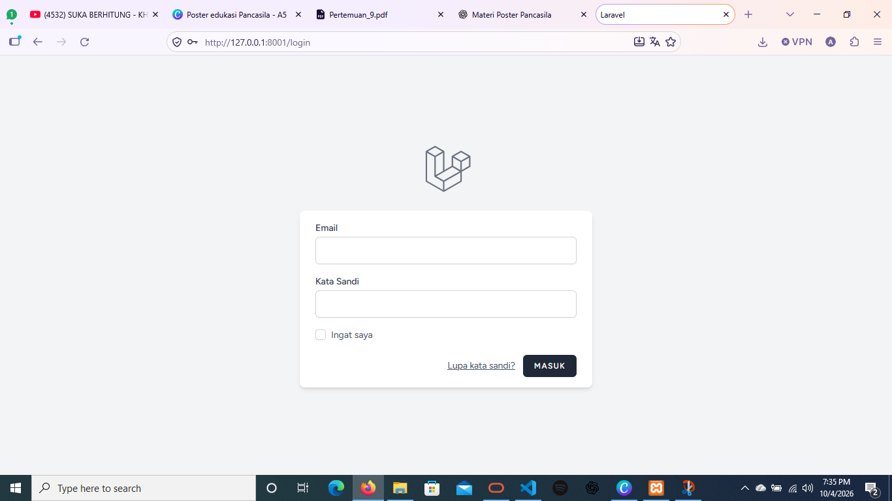
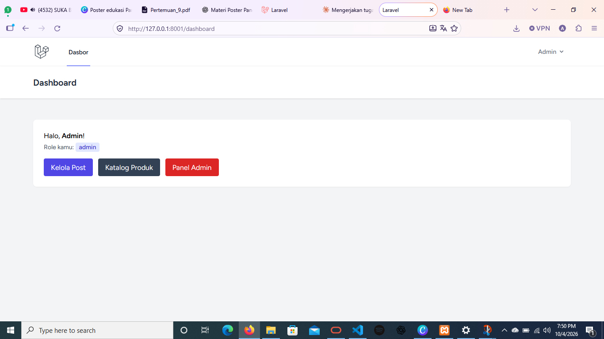
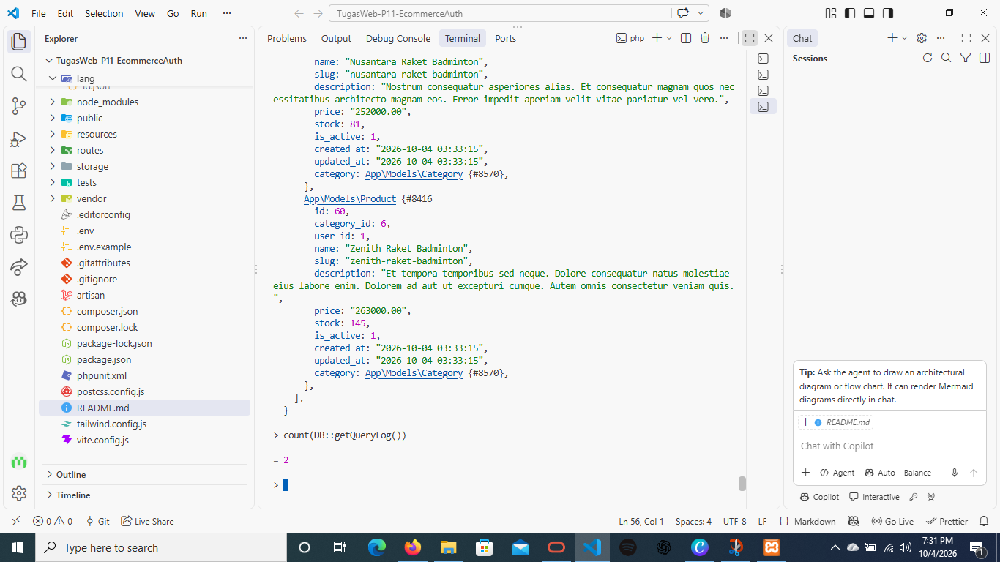

# TugasWeb-P11-EcommerceAuth

Tugas Rutin 11 Pemrograman Web

**Nama:** Diva Nadia Gea· **NIM:** 4253250044

## Cara install

Prasyarat: PHP 8.2, Composer, Node.js, MySQL aktif.

```bash
git clone https://github.com/USERNAME/TugasWeb-P11-EcommerceAuth.git
cd TugasWeb-P11-EcommerceAuth
composer install
npm install && npm run build      # (atau npm run dev saat development)
copy .env.example .env            # Mac/Linux: cp
php artisan key:generate
# buat database `tugasweb_p11`; set DB_CONNECTION=mysql & DB_DATABASE di .env
php artisan migrate:fresh --seed
php artisan serve
```

## Akun demo (password: `password`)

| Role | Email | Bisa apa |
|---|---|---|
| admin | admin@example.com | Panel `/admin/dashboard`, edit & hapus semua post |
| editor | editor@example.com | Edit semua post, hapus hanya post sendiri |
| user | user@example.com | Edit/hapus hanya post sendiri |

## Bagian A — Database & Eloquent

- 7 tabel: `users, categories, products, orders, order_items, tags, product_tag` (+ `posts` untuk latihan otorisasi) dengan FK constraint (`constrained()`, `cascadeOnDelete`, `restrictOnDelete`).
- Seeder + factory: 60 produk realistis (`ShopSeeder`), 10 user, 20 post, order + item.
- Model + relasi: `hasMany`, `belongsTo`, `belongsToMany` (pivot `product_tag`); scope `Product::active()` & `inStock()`.
- Dokumentasi 5 query Tinker: lihat `screenshots/tinker-*.png`.

## Bagian B — Auth & Security

- Laravel Breeze (login/register/logout/profile).
- Multi-role `admin/editor/user`: kolom `users.role` + middleware `EnsureRole` (alias `role`).
- `PostPolicy` (update/delete) dipakai lewat `$this->authorize()` di `PostController`.
- Proteksi route: `auth` (login), `role:admin` (`/admin/*`).
- Testing incognito 2 role: lihat `screenshots/test-*.png`.

## Struktur penting

| File | Fungsi |
|---|---|
| `database/migrations/*` | Skema database terversion |
| `database/seeders/ShopSeeder.php` | Data dummy e-commerce |
| `app/Models/*` | Model + relasi + scope |
| `app/Http/Middleware/EnsureRole.php` | Cek role |
| `app/Policies/PostPolicy.php` | Aturan edit/delete post |
| `routes/web.php` | Route + proteksi middleware |

## Dokumentasi

### Bagian A: Database & Eloquent

**Status migration (7 tabel e-commerce + FK)**



**Model Scope**



**5 Query Tinker**

Query 1



Query 2



Query 3



Query 4



Query 5



### Bagian B: Auth & Security

**Halaman login (Laravel Breeze)**



**Testing 2 role (incognito)**

Admin bisa membuka `/admin/dashboard`:



### Bonus: Eager Loading Demo

**Tanpa `with()` (N+1 query)**


**Dengan `with()` (eager loading)**


